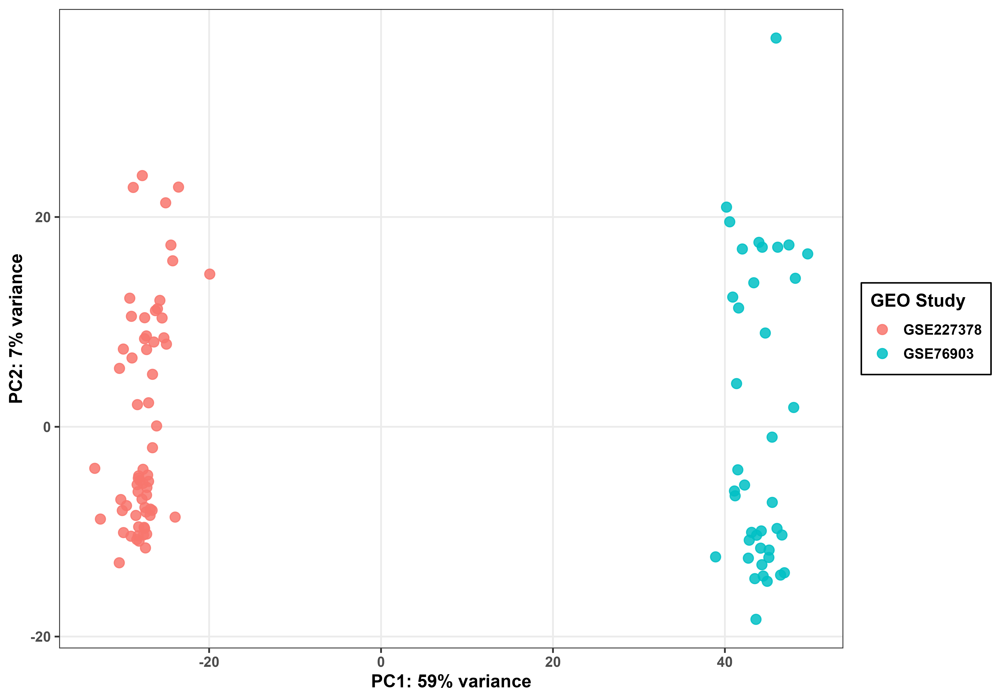
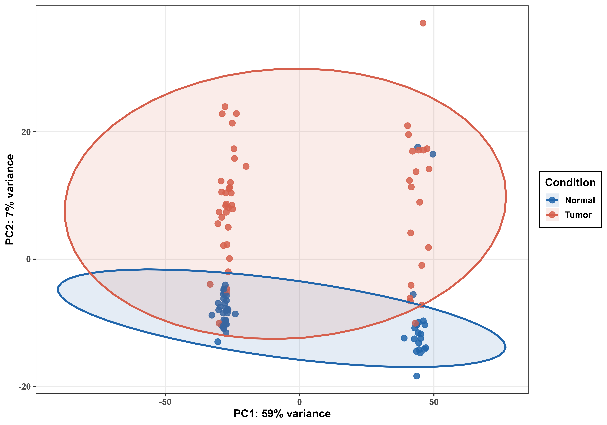
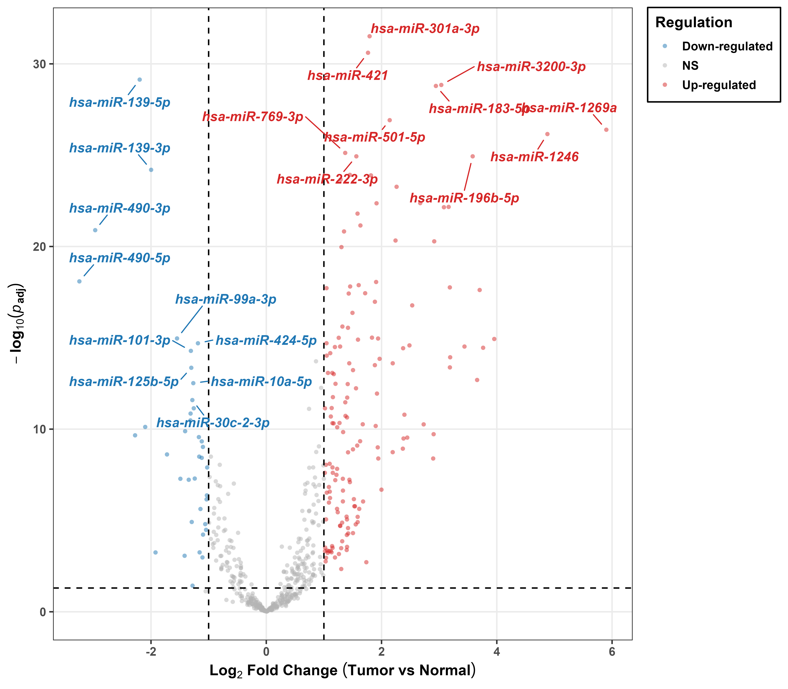

# Hepatocellular Carcinoma (HCC) miRNA-Gene Interactome Profiling

MicroRNAs (miRNAs) are small, non-coding RNA molecules that fundamentally regulate gene expression by binding to target messenger RNAs, causing their degradation or inhibiting translation. In cancer, dysregulated miRNAs can function as either oncogenes or tumor suppressors, heavily influencing tumor growth, progression, and metastasis. Because a single miRNA can target multiple genes across various signaling pathways, their abnormal expression often drives tumor survival and immune evasion. Identifying these specific miRNA signatures provides highly reliable diagnostic and prognostic biomarkers, opening new doors for targeted cancer therapies.

## Project Overview
This repository provides a high-throughput computational framework for evaluating differential miRNA expression in Hepatocellular Carcinoma (HCC). By integrating independent transcriptomic datasets across diverse sequencing platforms, this project identifies robust regulatory signatures while minimizing platform-specific technical variance.

## Main Analysis Script
The entire computational workflow—including data acquisition, preprocessing, batch correction, and target prediction—is executed via the following script:

* **[`mirna_hcc.R`](mirna_hcc.R)**: This modular R script handles the end-to-end pipeline and generates all statistical tables and publication-quality visualizations.

## Datasets Analyzed
Raw transcriptomic data was sourced from the NCBI Gene Expression Omnibus (GEO). The study utilizes a balanced dataset of 104 samples: 52 normal adjacent tissue controls and 52 HCC primary tumor samples.

* **GSE227378:** High-throughput small RNA sequencing (BGISEQ-500) of paired tumor and adjacent normal tissues from 32 HCC patients.
* **GSE76903:** Deep sequencing of small RNAs (Illumina HiSeq 2500). The analysis focused strictly on primary tumor and matched adjacent normal samples to maintain biological consistency.

## Key Findings: Top Differentially Expressed miRNAs
The following miRNAs exhibited the highest statistical significance and magnitude of change across the integrated cohorts.

### Top 5 Up-regulated miRNAs
| miRNA | Log2 Fold Change | Adjusted p-value |
|:---|:---:|:---:|
| hsa-miR-301a-3p | 1.79 | 3.08e-32 |
| hsa-miR-421 | 1.76 | 2.47e-31 |
| hsa-miR-3200-3p | 3.03 | 1.43e-29 |
| hsa-miR-183-5p | 2.94 | 1.62e-29 |
| hsa-miR-501-5p | 2.14 | 1.21e-27 |

### Top 5 Down-regulated miRNAs
| miRNA | Log2 Fold Change | Adjusted p-value |
|:---|:---:|:---:|
| hsa-miR-139-5p | -2.19 | 7.28e-30 |
| hsa-miR-139-3p | -1.99 | 6.34e-25 |
| hsa-miR-490-3p | -2.96 | 1.28e-21 |
| hsa-miR-490-5p | -3.24 | 8.13e-19 |
| hsa-miR-99a-3p | -1.54 | 1.08e-15 |

## Analytical Methodology

### 1. Data Normalization and Batch Correction
* Raw miRNA counts were merged and normalized using `DESeq2`.
* To mitigate sequencing platform bias (BGISEQ vs. Illumina), the study origin was explicitly incorporated as a covariate in the DESeq2 design matrix (`~ batch + condition`).

### 2. miRNA Target Discovery (miRTarBase and miRDB)
* Functional targets were identified via the `multiMiR` package.
* **High-Confidence Filtering:** Gene targets were identified by intersecting experimentally validated interactions from **miRTarBase** with predicted interactions from **miRDB** (Target Prediction Score >= 80).

## Visualizations

### 1. Quality Control and Principal Component Analysis
The plots below demonstrate the distribution of samples before (Top) and after (Bottom) applying batch correction to remove sequencing platform-specific variance.

  
  

  
  

### 2. Differential Expression Landscape
The Volcano plot and Heatmap highlight global miRNA expression shifts and consistency across the 104 samples.

  
  

## miRNA-Gene Interaction Outputs
* **STRING-db:** Formatted gene lists for protein-protein interaction (PPI) network construction.
* **Network Hubs:** Matrices mapping the targeting degree (quantifying how many miRNAs target a single gene).
* **Clinical Validation:** Standardized ID formatting for external survival validation in TCGA-LIHC cohorts via UALCAN.

## Repository Structure
* **`mirna_hcc.R`**: Core R script executing the full transcriptomic and target prediction workflow.
* **`/results/tables/`**: DESeq2 results, count matrices, and database interaction tables.
* **`/results/plots/`**: Publication-quality graphical outputs in PNG and TIFF formats.
* **`.gitignore`**: Configured to exclude heavy raw data files and massive TIFF images.

## R Dependencies
`GEOquery`, `DESeq2`, `limma`, `ComplexHeatmap`, `multiMiR`, `tidyverse`, `ggplot2`.
